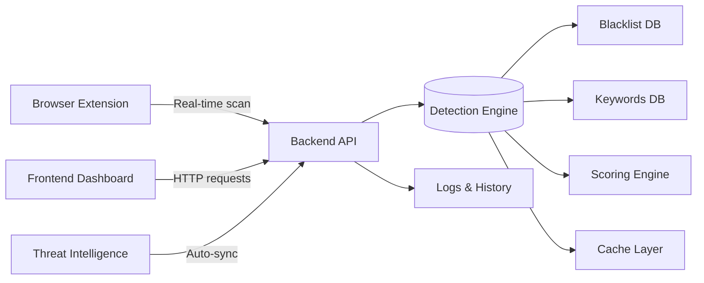

# 🛡️ Phishing URL Detector

A real-time, multi-layered phishing detection system for identifying malicious URLs using advanced pattern matching, threat intelligence, and behavioral analysis.


## ✨ Features

| Feature | Description |
|---------|-------------|
| **⚡ Lightning-Fast Analysis** | O(1) blacklist lookup via hash set + optimized string algorithms |
| **🔍 Multi-Pattern Keyword Search** | Aho-Corasick automaton for efficient detection of 35+ suspicious keywords |
| **🧬 Typosquatting Detection** | Levenshtein distance analysis to catch domain impersonation (e.g., `g00gle.com`) |
| **🎯 Advanced Pattern Matching** | KMP & Boyer-Moore algorithms for complex URL structure analysis |
| **📊 Weighted Scoring Engine** | 13-point threat assessment scoring with severity-based confidence |
| **🔄 Auto-Updating Blacklists** | Daily sync from PhishTank and OpenPhish APIs |
| **📈 Real-Time Statistics & History** | Dashboard with detection metrics and persistent history logs |
| **📤 Browser Extension Support** | Chrome/Edge extension for on-the-fly URL scanning |
| **📦 Batch Analysis** | Analyze up to 100 URLs in a single request |
| **⚠️ Reporting & Feedback** | Report new phishing URLs to improve the system |

## 🧠 Detection Methodology

The detector combines 6 complementary techniques:

1. **Domain Blacklist Lookup** — Hash-set O(1) check against curated phishing domains
2. **Keyword Matching** — Aho-Corasick automaton scans for suspicious terms (`login`, `verify`, `secure`, etc.)
3. **Typosquatting Analysis** — Levenshtein distance detects lookalike domains (`paypa1.com` vs `paypal.com`)
4. **URL Structure Validation** — Checks for abnormal path depth, excessive parameters, IP-based hosts, and obfuscation patterns
5. **TLD & Subdomain Analysis** — Flags suspicious TLDs (`.tk`, `.ml`, `.ga`) and unnatural subdomain chains
6. **Whitelist Bypass Prevention** — Ensures legitimate domains aren’t masked by redirects or cloaking

Each technique contributes a weighted score (0–5 points). Final risk level is determined as:
- `safe`: total ≤ 3
- `suspicious`: 4–8
- `dangerous`: ≥ 9

## 🌐 System Architecture



## 🚀 Getting Started

### Prerequisites
- Python 3.12+
- Node.js (optional, only needed if enhancing frontend)

### Backend Setup

```bash
# Navigate to backend
cd backend

# Install dependencies
pip install --break-system-packages -r requirements.txt

# Start the API server
python app.py
```

> ✅ Server runs on `http://localhost:5000`

### Frontend Setup

```bash
# In a separate terminal
cd frontend
python3 -m http.server 8000
```

> ✅ Open `http://localhost:8000` in your browser

### Browser Extension (Optional)

1. Open Chrome/Edge → `chrome://extensions`
2. Enable "Developer mode"
3. Click "Load unpacked" → select `browser-extension/` folder
4. Visit any webpage — the extension icon will show real-time risk status

## 📡 API Reference

All endpoints accept/return JSON. Base URL: `http://localhost:5000/api`

| Endpoint | Method | Description |
|----------|--------|-------------|
| `/` | `GET` | API info & available endpoints |
| `/check` | `POST` | Analyze single URL (`{ "url": "https://..." }`) |
| `/batch` | `POST` | Analyze multiple URLs (`{ "urls": ["...", "..."] }`) |
| `/stats` | `GET` | Get detection statistics (total, safe, phishing %, cache hit rate) |
| `/history` | `GET` | Retrieve detection history (supports `?limit=50&risk_level=dangerous`) |
| `/update-blacklist` | `POST` | Trigger manual blacklist update from threat feeds |
| `/report` | `POST` | Report a new phishing URL (`{ "url": "...", "comment": "..." }`) |
| `/health` | `GET` | Health check with component statuses |
| `/clear-cache` | `POST` | Reset detection cache |
| `/analyze-detailed` | `POST` | Full algorithm breakdown + URL components |

### Example cURL Request

```bash
curl -X POST http://localhost:5000/api/check \
  -H "Content-Type: application/json" \
  -d '{"url": "https://secure-account-verify.tk/login"}'
```

### Sample Response

```json
{
  "url": "https://secure-account-verify.tk/login",
  "timestamp": "2026-06-23T01:51:24.148889",
  "risk_level": "dangerous",
  "total_score": 14,
  "confidence": 0.98,
  "recommendation": {
    "icon": "🚨",
    "message": "High-risk phishing site. Do not enter credentials."
  },
  "threats_detected": [
    {
      "type": "blacklist_match",
      "severity": "critical",
      "description": "Domain 'secure-account-verify.tk' is in phishing blacklist",
      "score": 5
    }
  ],
  "details": {
    "domain": "secure-account-verify.tk",
    "tld": "tk",
    "path_depth": 1,
    "query_params_count": 0,
    "has_ip_address": false,
    "is_https": true
  }
}
```

## 📁 Project Structure

```
Phishing-URL-detector/
├── backend/                 # Flask API & core detection logic
│   ├── app.py               # Main API server
│   ├── detector.py          # PhishingDetector class & analysis pipeline
│   ├── algorithms.py        # Aho-Corasick, KMP, Levenshtein implementations
│   ├── scoring.py           # Risk scoring & recommendation engine
│   ├── utils/               # Validators, blacklist updater, helpers
│   └── datasets/            # Local threat intel (keywords, URLs)
├── frontend/                # Static dashboard UI
│   ├── index.html           # Main UI
│   ├── script.js            # API interaction & rendering logic
│   └── styles.css             # Responsive styling
├── browser-extension/       # Chrome/Edge extension
│   ├── manifest.json        # Extension config
│   ├── background.js        # URL monitoring logic
│   └── popup.js             # Popup UI & reporting
├── datasets/                # Threat intelligence sources
│   ├── keywords.json        # Suspicious/dangerous keyword categories
│   ├── phishing_urls.txt    # Curated blacklist
│   └── legitimate_urls.txt  # Whitelist reference
├── logs/                    # Persistent detection history & reports
│   ├── detection_history.json
│   └── reported_urls.json
└── tests/                   # Unit & integration tests
```

## 🛡️ Threat Intelligence Sources

- **PhishTank API**: Real-time phishing URL feed
- **OpenPhish API**: Verified phishing domain database
- **Curated Keyword Database**: 35+ high-fidelity suspicious terms (`login`, `verify`, `account`, `password`, etc.)
- **Manual Reporting**: Community-driven blacklist expansion via `/api/report`

## 🧪 Testing

Run backend unit tests:

```bash
cd backend
pytest test_detector.py test_algorithms.py
```

Run frontend smoke test:

```bash
cd frontend
# Manually verify UI loads at http://localhost:8000
```

## 🤝 Contributing

Contributions are welcome! Please follow these steps:

1. Fork the repository
2. Create a feature branch (`git checkout -b feature/awesome-feature`)
3. Commit your changes (`git commit -m 'Add awesome feature'`)
4. Push to the branch (`git push origin feature/awesome-feature`)
5. Open a pull request

Please ensure:
- New detection logic includes unit tests
- API changes are documented in `README.md`
- Frontend changes preserve accessibility & responsive behavior

## 📜 License

Distributed under the MIT License. See `LICENSE` for more information.

## 🙏 Acknowledgements

- [Aho-Corasick Algorithm](https://en.wikipedia.org/wiki/Aho%E2%80%93Corasick_algorithm)
- [PhishTank](https://www.phishtank.com/)
- [OpenPhish](https://openphish.com/)
- [tldextract](https://pypi.org/project/tldextract/) for domain parsing
- [Flask](https://flask.palletsprojects.com/) & [Flask-CORS](https://flask-cors.readthedocs.io/)

---
